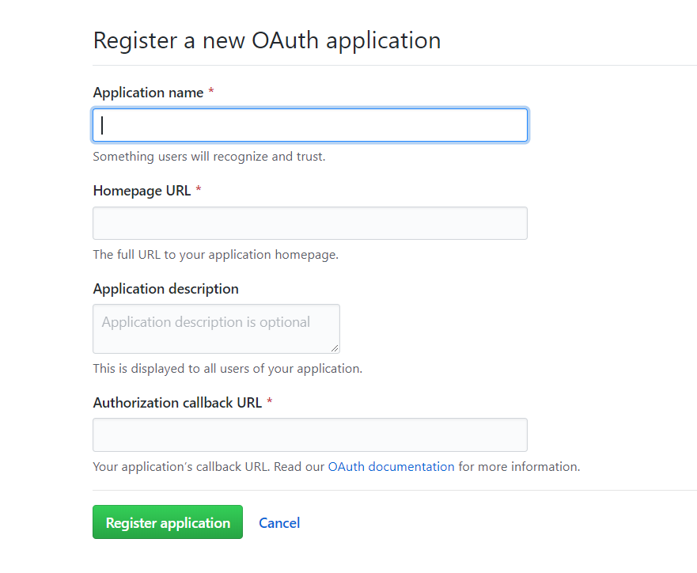
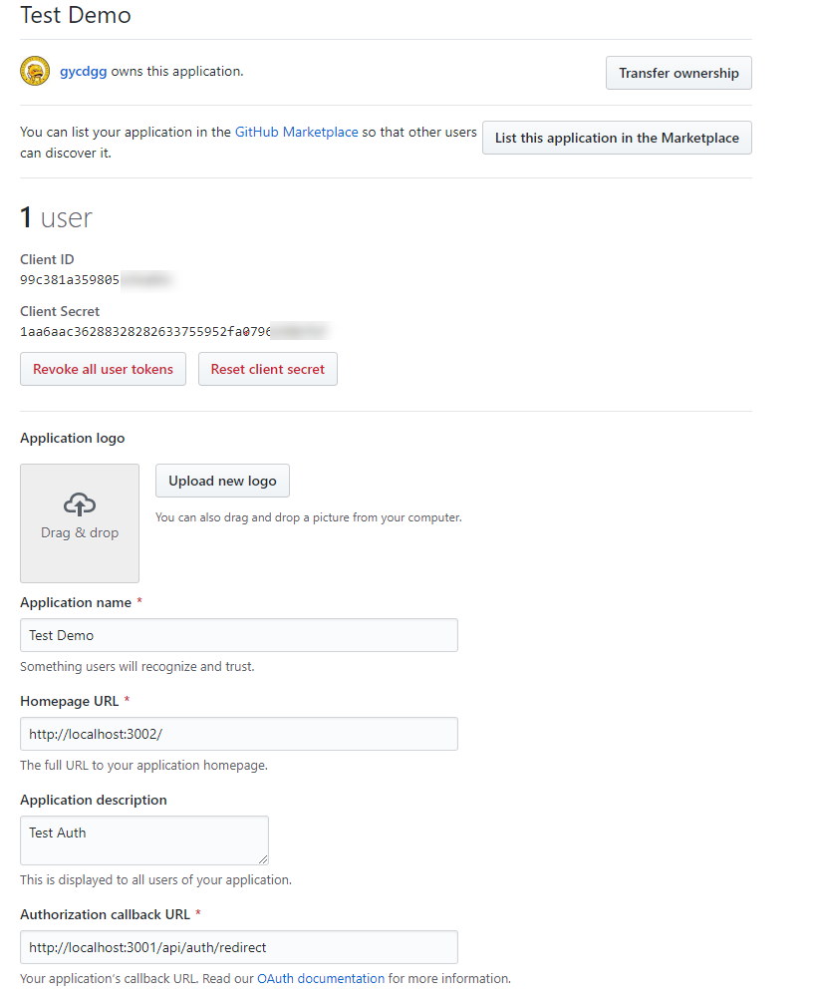
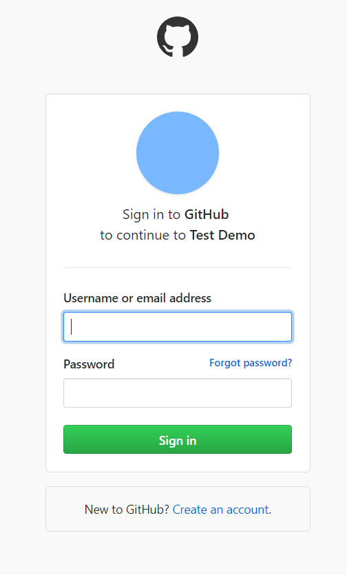
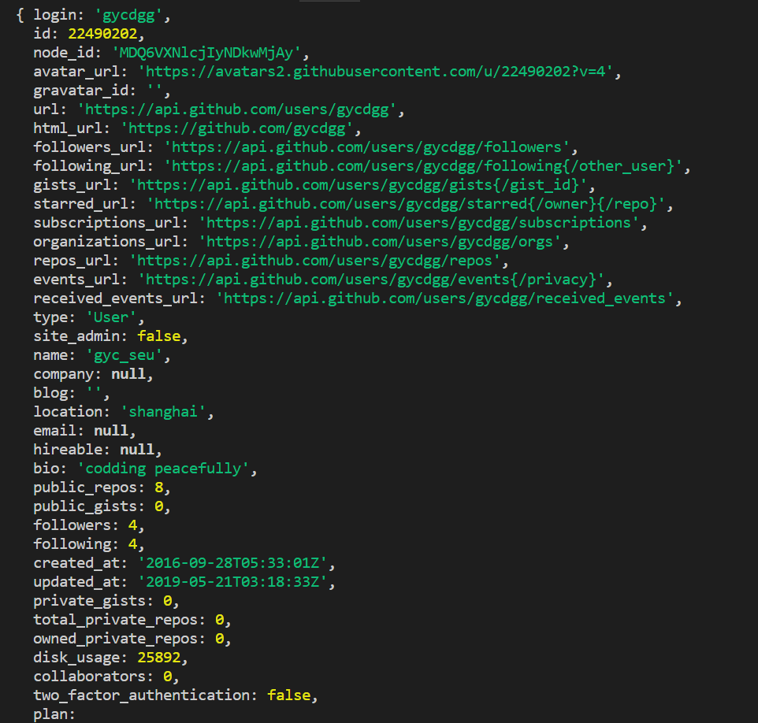

## OAuth2授权Study

### OAuth简介

 OAuth（开放授权）是一个开放标准，允许用户授权第三方网站访问他们存储在另外的服务提供者上的信息，而不需要将用户名和密码提供给第三方网站或分享他们数据的所有内容。本质的核心是**向第三方应用颁发令牌。**

国内各大app都在2012年前后实现了授权登录。
常见的QQ登录微信登录等

这个demo选取了github做例子。
根本原因是github支持本地调试，并且无需审核。国内网站都需要备案。
但是所有的实现思路都一样，细节上有差异。


### github平台申请授权的web应用


申请成功后如下


生成了一个client_id和client_secret

### OAuth常见的步骤
1. 请求授权码

第一步，A（我自己的网站） 网站提供一个链接，用户点击后就会跳转到 B（github提供） 网站，授权用户数据给 A 网站使用。下面就是 A 网站跳转 B 网站的一个示意链接。


```html
<a href = "https://github.com/login/oauth/authorize?client_id=99c381a359805c64a86c&redirect_uri=http://localhost:3001/api/auth/redirect&scope=user,public_repo"></a>
```

**tips**

<ul>
<li>client_id是我去github开发者平台给我的网站申请后，github提供的，这里可以告诉github哪个网站在请求授权码</li>
<li>
redirect_uri是callback url，用户登录成功github服务器会向这个url发请求
</li>
<li>
  scope代表申请的信息权限。user代表用户基本信息（用户名，昵称，坐标等），public_repo是github公共的仓库
</li>
</ul>


2. 跳转登录

跳转后会要求登录，并且询问是否给当前网站授权。操作成功后，github服务器会给上面的redirect_uri发送请求并且请求参数会附带授权码。

用户登录：



在自己的服务器后端实现接口，接受来自github发起的请求。

```js
  // 获取github服务器提供的Authorization code（授权码）
  if(ctx.url.includes("api/auth/redirect")){
    console.log(ctx.query.code)
    const auth_code = ctx.query.code
  }
```

3. 申请token（令牌）

拿到授权码(auth_code)后，就可以申请token。 github服务器提供了申请token的api，
这一步需要我们准备好的client_id和client_secret.考虑到安全问题，一般都在后端实现

```js
    const auth_code = "xxxxx" // 上一步获取的授权码
    const clientID = "99c381a359805c6XXXX"
    const clientSecret = "1aa6aac36288328282633755952fa0796290XXXX"
    const tokenResponse = await axios({
      method: 'post',
      url: 'https://github.com/login/oauth/access_token?' +
        `client_id=${clientID}&` +
        `client_secret=${clientSecret}&` +
        `code=${auth_code}`,
      headers: {
        accept: 'application/json'
      }
    });
    console.log(tokenResponse)       
```

tokenResponse:

```json
{ "access_token": "ed1d681472fef631a2afa1f2a26bb5542ed7xxxx",
  "token_type": "bearer",
  "scope": "public_repo,user" 
  }
```
流程图如下：


4. 通过token获取信息

上一步已经拿到了token。再去调用github的api时在请求头中加入token就能获取用户信息了。

**这里是用户信息是github愿意公开的信息，用户密码，用户私有仓库等都不会开放**
通过token调用github api获取用户信息
```js
const result = await axios({
      method: 'get',
      url: `https://api.github.com/user`,
      headers: {
        accept: 'application/json',
        Authorization: `token ${tokenResponse.data.access_token}`
      }
    });
```

请求response如下：


到这里OAuth实现已经完成了，后续做路由跳转或者账号绑定，根据自己产品需求来做就好了。
在这个demo中拿到数据后直接重定向到一个空白页面，展现用户头像和基本信息

### 其他平台
微信扫码登录

<ul>
  <li>第三方发起微信授权登录请求，微信用户允许授权第三方应用后，微信会拉起应用或重定向到第三方网站，并且带上授权临时票据code参数；</li>
  <li>通过code参数加上AppID和AppSecret等，通过API换取access_token和平台唯一性标识open_id；</li>
  <li>通过access_token进行接口调用，获取用户基本数据资源或帮助用户实现基本操作。</li>
</ul>
以下是京东微信登录的链接
京东：<a href = "https://open.weixin.qq.com/connect/qrconnect?appid=wx827225356b689e24&state=28136823BFAE1B276713E62C5BCC905639E432AD94386C80756ACAA4306D4AD05AFBDDF21786199D3CC10733743AC209&redirect_uri=https%3A%2F%2Fqq.jd.com%2Fnew%2Fwx%2Fcallback.action%3Fview%3Dnull%26uuid%3D9fe9c6e5b2774cac8507a2f2efb54813&response_type=code&scope=snsapi_login#wechat_redirect">点击登录京东</a>

## 小结
目前国内的app或者web应用大多数都接入了微信扫码、QQ登录等。
国外平台，facebook，linkedIn，google等也都有开放api供开发者使用。


之所以这么火，很大程度还是因为能够带来很多便捷，避免记很多账号密码。
其次也能保证信息安全。微信/github账号密码对项目都是不可见的，登录界面都是微信官方提供。微信、github服务器对项目服务器也不可能有信息剽窃。

